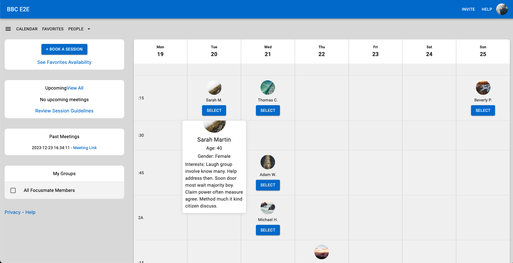

# Focus Mate Frontend

This is the frontend application for the Focus Mate project, providing a user interface to interact with the backend service, view user profiles, and manage meetings. The frontend is built using React and Material-UI, styled with SCSS, and integrates with the backend API to display user data and manage meetings.



## Features

- **User Profile Display**: Shows the main person’s profile in the header.
- **Calendar View**: Displays meetings in a calendar format, with functionality to select users and view their details.
- **Sidebar**: Shows upcoming meetings and allows interaction with selected users.
- **Responsive Design**: Adjusts layout based on screen size to ensure a seamless user experience.

## Technologies Used

- **React**: JavaScript library for building user interfaces.
- **Material-UI**:: React component library for styling and UI components.
- **Axios**: HTTP client for making API requests to the backend.
- **ESLint and Prettier**: Tools for code quality and formatting.

## Installation and Setup

### Prerequisites

- Node.js (version 18 or higher)
- npm or yarn (package managers)

### Clone the repository

```bash
git clone https://github.com/yourusername/focus-mate_frontend.git
cd focus-mate_frontend
```

### Install dependencies

```bash
npm install
# or
yarn install
```

### Run the Development Server

```bash
npm start
# or
yarn start
```

The application will be available at http://localhost:3000.

### Build for Production

To create a production build of the frontend application, run:

```bash
npm run build
# or
yarn build
```

The build will be located in the `build` directory.

## Usage

### 1. Main Person and Sidebar

- The Header displays the main person's profile.
- The Sidebar shows upcoming meetings and allows interaction with selected users.

### 2. Calendar Component

- Displays meetings in a calendar format.
- Users can select a person to add them to the sidebar's upcoming meetings section.

### 3. Select and Manage Users

- Use the Select button in the calendar to add a user to the sidebar.
- Users can be removed from the sidebar by clicking the Remove button.

## Future Improvements

- Enhance user interaction with more detailed profiles.
- Implement advanced filtering and search in the calendar.
- Add user authentication and profile management features.
- Optimize performance and enhance accessibility features.

## License

This project is licensed under the MIT License. See the [LICENSE](https://chatgpt.com/c/LICENSE) file for details.
