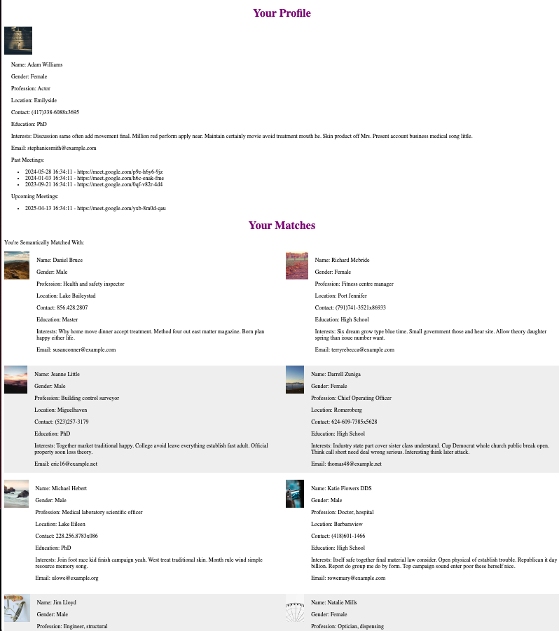

# Focus Mate DB Backend

This is the backend service for the Focus Mate application, which is responsible for managing user data, scheduling meetings, and calculating semantic similarities between users based on their profiles. The backend uses Python with Flask, SQLite as the database, and BERT-based NLP for semantic analysis.

  

## Features

- Person Database: Stores user information and profiles.
- Meeting Scheduling: Generates and stores random meetings between users.
- Semantic Similarity Calculation: Uses BERT embeddings to compute the similarity between user profiles.
- RESTful API: Provides endpoints to interact with the database for users and meetings.

## Technologies Used

- **Python 3.12**
- **Flask**: Lightweight web framework for building APIs.
- **SQLite**: Lightweight SQL database used to store user and meeting data.
- **Transformers (HuggingFace)**: BERT-based model for semantic similarity analysis.
- **Docker**: Dockerized environment for the backend service.
- **SQLite3**: Database to store user information and meeting schedules.

## Installation and Setup

### Prerequisites

- Python 3.12 or higher
- pip (Python package manager)
- SQLite3 (pre-installed in most environments)

#### Clone the repository

```bash
git clone https://github.com/yourusername/focus-mate_db_backend.git
cd focus-mate_db_backend
```

#### Set up the virtual environment

```bash
python -m venv venv
source venv/bin/activate  # On Windows: venv\Scripts\activate
```

#### Install dependencies

```bash
pip install -r requirements.txt
```

#### Create the SQLite database

```bash
python create_db.py
```

#### Running the Backend

```bash
python app.py
```

The backend will start running on http://localhost:5000.

## Usage

### 1. API Endpoints

- /api/people: Get a list of all people in the database.
- /api/meetings: Get a list of all meetings scheduled.
- /api/similarity: Calculate and retrieve the semantic similarity between two users.

### 2. Generating Random Meetings

To generate random meetings between users, run:

```bash
python generate_random_meetings.py
```

This will create a set of random meetings in the database with associated Google Meet links.

### 3. Semantic Similarity

The backend uses BERT to compute the semantic similarity between users. To calculate and store these similarities in the database, use:

```bash
python compute_similarity.py
```

This will populate the Similarities table with the computed values.

## Database Structure

- **Person Table**: Contains user profiles (ID, name, profile information, etc.).
- **Meetings Table**: Stores the meeting details (ID, person1, person2, meeting date, and meeting link).
- **Similarities Table**: Stores semantic similarity between two users based on their profile.

## Docker

To run the backend in a Docker container:

1. Build the Docker image:

```bash
docker build -t focus-mate-backend .
```

2. Run the container:

```bash
docker run -p 5000:5000 focus-mate-backend
```

## Future Improvements

- Implement user authentication and authorization.
- Extend API to allow scheduling meetings directly via the frontend.
- Switch from SQLite to a more scalable database like PostgreSQL or MySQL.
- Add unit and integration tests.

## License

This project is licensed under the MIT License. See the [LICENSE](https://chatgpt.com/c/LICENSE) file for details.
